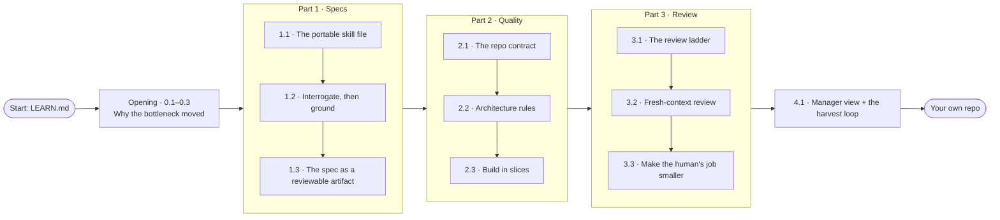
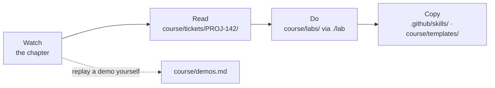
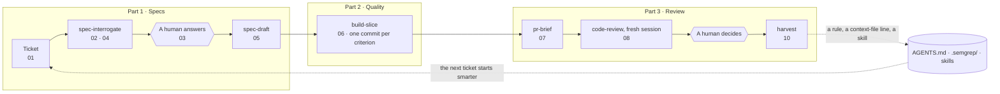
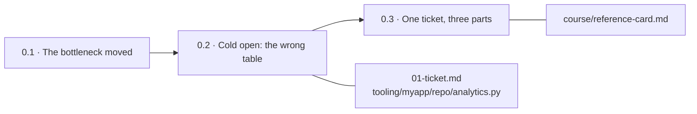
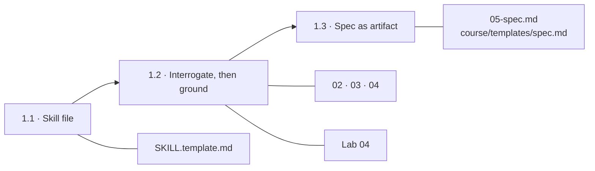
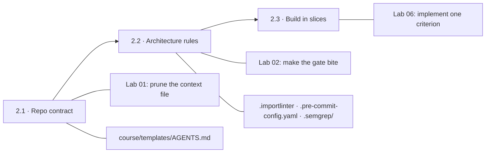
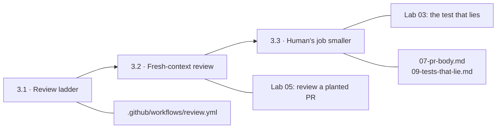
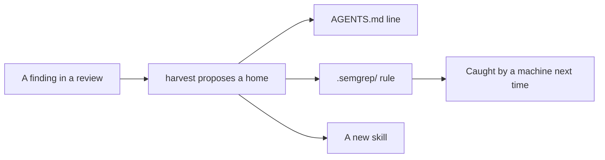
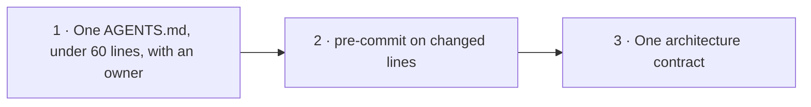

# Learner's guide

How this repository maps onto the masterclass, chapter by chapter. Each chapter follows the same
four steps:

- **Watch** the chapter.
- **Read** the worked example.
- **Do** the lab, where there is one.
- **Copy** what you want into your own repository.

New here? [`LEARN.md`](../LEARN.md) helps you choose how deep to go. Skills not installed yet?
See [Install the skills](../README.md#install-the-skills).

## The chapters

The masterclass has an opening, three parts and a close. Each chapter is numbered within its
part, so `2.2` is the second chapter of Part 2. Labs and demos use the same numbers.

| Chapter | Title |
|---|---|
| **Opening** | |
| 0.1 | The bottleneck moved |
| 0.2 | Cold open: the wrong table |
| 0.3 | One ticket, three parts |
| **Part 1 · Specs** | |
| 1.1 | The portable skill file |
| 1.2 | Interrogate, then ground |
| 1.3 | The spec as a reviewable artifact |
| **Part 2 · Quality** | |
| 2.1 | The repo contract |
| 2.2 | Architecture rules the agent can't argue with |
| 2.3 | Build in slices, watch the churn |
| **Part 3 · Review** | |
| 3.1 | The review ladder |
| 3.2 | Fresh-context review |
| 3.3 | Make the human's job smaller |
| **Close** | |
| 4.1 | What the manager sees, and the harvest |

## The whole masterclass on one page

One ticket, `PROJ-142` "Export report times out", runs through all three parts.

## The four steps, and where each lives

| Step | Where | How |
|---|---|---|
| Watch | the masterclass video | Each chapter below names the demos it shows |
| Replay a demo | [`course/demos.md`](demos.md) | The exact commands, so you can run any demo yourself |
| Read | [`course/tickets/PROJ-142/`](tickets/PROJ-142/) | Files `00`–`10`, in the order the chapters use them |
| Do | [`course/labs/`](labs/) | `./lab start NN`, then `check NN`, then `solution NN` |
| Copy | [`.github/skills/`](../.github/skills/), [`course/templates/`](templates/) | Into your own repository, one pull request at a time |

## The chain the ticket goes through

Every skill reads the file the one before it wrote, and two of them stop for a human. This is
the backbone of chapters 1.2 to 4.1.

The numbers are the files in [`course/tickets/PROJ-142/`](tickets/PROJ-142/): `01-ticket.md`,
`02-interrogation.md`, `03-answers.md`, `04-touchpoints.md`, `05-spec.md`, `06-git-log.txt`,
`07-pr-body.md`, `08-review.md` and `10-harvest.md`.

Two of them are wrong on purpose: `08-review.md` has one false finding, and
`09-tests-that-lie.md` opens with a test that checks nothing. Find both yourself before the chapters reveal them.

## Opening · chapters 0.1–0.3

| Chapter | Read | Do | Copy |
|---|---|---|---|
| 0.1 · The bottleneck moved | [`LEARN.md`](../LEARN.md) | — | — |
| 0.2 · Cold open | [`01-ticket.md`](tickets/PROJ-142/01-ticket.md), then [`tooling/myapp/repo/analytics.py`](../tooling/myapp/repo/analytics.py), the table the agent wrongly picks. Demo D1 | — | — |
| 0.3 · The map | [`course/reference-card.md`](reference-card.md), "The chain" | — | Pin the card up |

## Part 1 · Specs: chapters 1.1–1.3

| Chapter | Read | Do | Copy |
|---|---|---|---|
| 1.1 · The portable skill file | [`SKILL.template.md`](../.github/skills/_template/SKILL.template.md), and one real skill, [`spec-interrogate`](../.github/skills/spec-interrogate/SKILL.md). Demo D11 | Try one skill: [`LEARN.md`](../LEARN.md) step 2 | [Install the skills](../README.md#install-the-skills) |
| 1.2 · Interrogate, then ground | [`02-interrogation.md`](tickets/PROJ-142/02-interrogation.md), [`03-answers.md`](tickets/PROJ-142/03-answers.md), [`04-touchpoints.md`](tickets/PROJ-142/04-touchpoints.md). Demo D13 | [Lab 04 · Interrogate a real ticket](labs/04-interrogate-a-real-ticket/lab.md) | `spec-interrogate` |
| 1.3 · The spec as a reviewable artifact | [`05-spec.md`](tickets/PROJ-142/05-spec.md). Demo D14 | — | [`course/templates/spec.md`](templates/spec.md), `spec-draft` |

## Part 2 · Quality: chapters 2.1–2.3

| Chapter | Read | Do | Copy |
|---|---|---|---|
| 2.1 · The repo contract | [`00-agents-draft.md`](tickets/PROJ-142/00-agents-draft.md) (166 lines generated), then [`course/templates/python/AGENTS.md`](templates/python/AGENTS.md) (75 kept). Demos D3, D12 | [Lab 01 · Prune the context file](labs/01-prune-the-context-file/lab.md) | [`course/templates/AGENTS.md`](templates/AGENTS.md) |
| 2.2 · Architecture rules the agent can't argue with | [`.importlinter`](../.importlinter), [`.pre-commit-config.yaml`](../.pre-commit-config.yaml), [`.semgrep/`](../.semgrep/). Demos D4, D8, D10, D17 | [Lab 02 · Make the gate actually bite](labs/02-make-the-gate-bite/lab.md) | `stack-profile`, then `gates-draft`, on your repo |
| 2.3 · Build in slices, watch the churn | [`06-git-log.txt`](tickets/PROJ-142/06-git-log.txt). Demo D5 | [Lab 06 · Implement one criterion](labs/06-implement-one-criterion/lab.md) | `build-slice` |

Labs 01–03 need nothing installed. Labs 04–06 need an assistant, so they come last.

## Part 3 · Review: chapters 3.1–3.3

| Chapter | Read | Do | Copy |
|---|---|---|---|
| 3.1 · The review ladder | [`review.yml`](../.github/workflows/review.yml), [`pull_request_template.md`](../.github/pull_request_template.md), [`CODEOWNERS`](../.github/CODEOWNERS) | — | The PR template and `CODEOWNERS` |
| 3.2 · Tier 2: fresh-context review | [`08-review.md`](tickets/PROJ-142/08-review.md). One finding is wrong: which one? Demo D6 | [Lab 05 · Review a planted pull request](labs/05-review-a-planted-pr/lab.md) | `code-review` |
| 3.3 · Make the human's job smaller | [`07-pr-body.md`](tickets/PROJ-142/07-pr-body.md), [`09-tests-that-lie.md`](tickets/PROJ-142/09-tests-that-lie.md). Demos D7, D9, D15 | [Lab 03 · The test that lies](labs/03-the-test-that-lies/lab.md) | `pr-brief` |

## Close · chapter 4.1

| Chapter | Read | Do | Copy |
|---|---|---|---|
| 4.1 · What the manager sees, and the harvest loop | [`10-harvest.md`](tickets/PROJ-142/10-harvest.md), [`harvest/ledger.md`](../harvest/ledger.md), and the rule the loop produced, [`.semgrep/unbounded-export-query.yml`](../.semgrep/unbounded-export-query.yml). Demo D16 | Run `harvest` at the end of your next real ticket | `harvest`, [`course/templates/governance.example.md`](templates/governance.example.md) |

## After the masterclass

Three pull requests, each under an hour. The short version is in the README's
[90-minute path](../README.md#the-90-minute-path-if-you-only-do-one-thing). Want more practice? Work through
the second worked ticket, [`course/tickets/PROJ-207/`](tickets/PROJ-207/), the same way.
